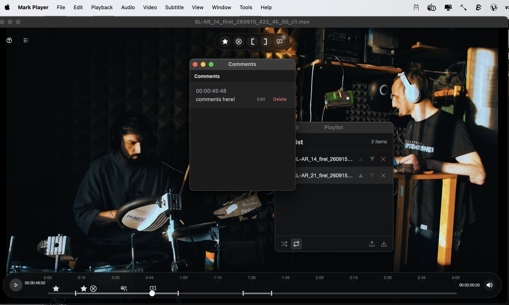
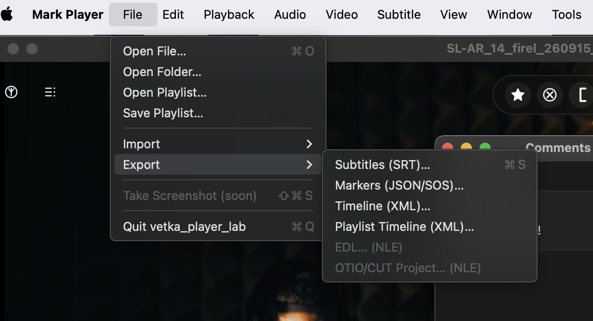
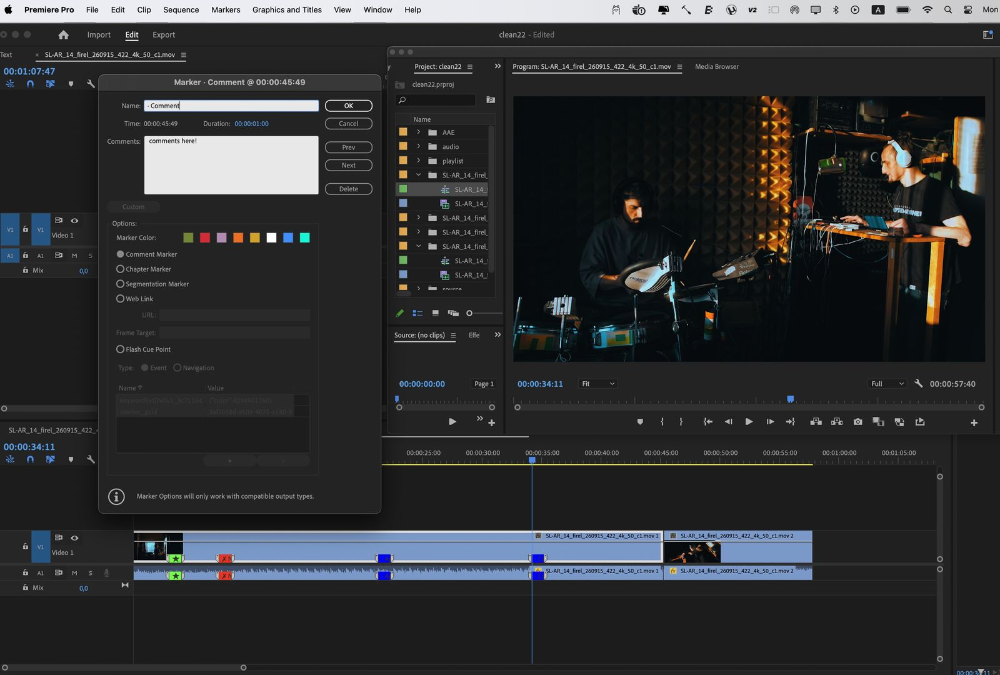

# Mark Player 0.19 beta, by VETKA lab


Marker-first video review: open a file, mark the moments, land them in Premiere — frame-accurately.

[⬇ Download for macOS (Apple Silicon)](https://github.com/danilagoleen/mark-player/releases/download/v0.18.0/Mark.Player_0.18.0_aarch64.dmg) ·
[Intel Mac](https://github.com/danilagoleen/mark-player/releases/download/v0.18.0/Mark.Player_0.18.0_x64.dmg) ·
[Windows](https://github.com/danilagoleen/mark-player/releases/download/v0.18.0/Mark.Player_0.18.0_x64-setup.exe)

## Screenshots


*Flags on the timeline, comment window, playlist — marking in action.*


*File → Export: SRT subtitles, JSON sidecar, single-video XML, playlist XML.*


*The payoff: playlist XML opens in Premiere as a ready timeline — clips, cuts and colored markers on the exact frames. File → Import the .xml; DaVinci Resolve takes it the same way.*

## Why: twenty years in three megabytes


Before I became an editor, I worked in a bookstore, in the art albums section. That's where I fell in love with one album: Bert Stern's last shoot of Marilyn Monroe.

The approved frames went to Vogue. But I couldn't let go of the ones she struck out herself — some with lipstick, some as if with a nail.

Twenty years of editing — and the same pain every time: "fix it right there, at the second minute, where she's smiling." No timecode. I waited for YouTube, with its billions, to make a comment pinned to the timeline. Then I realized: programmers just don't know our pain.

I'm not a programmer. But I knew: SRT subtitles already carry a timecode. And from a timecode you can build XML for any editing suite. It seems simple — yet somehow nobody had done it. Until now.

**Mark Player is twenty years in three megabytes.**

Marilyn marked the frames she didn't like. Now any producer marks right in the player — what they love and what they don't. Press M, type a couple of words, and the comment marker lands in Premiere on the exact frame where it was placed. No back-and-forth. No lost timecodes.

*Русская версия — ниже.*

До того как стать режиссёром монтажа, я работал в книжном магазине, в отделе альбомов по искусству. Там я влюбился в один альбом: Берт Штерн, последняя съёмка Мэрилин Монро.

В Vogue ушли одобренные кадры. А меня не отпускали те, что она перечеркнула сама: одни помадой, другие будто гвоздём.

Двадцать лет монтажа — и одна и та же боль: «поправь вот там, на второй минуте, где она улыбается». Без таймкода. Я ждал, что YouTube с его миллиардами сделает комментарий, привязанный ко времени. Потом понял: программисты просто не знают нашей боли.

Я не программист. Но я знал: в субтитрах SRT уже есть таймкод. А из таймкода можно сделать XML для любой монтажки. Кажется, это просто, но почему-то никто этого еще не сделал, до этого момента.

**Mark Player — это двадцать лет в трёх мегабайтах.**

Мэрилин метила кадры, которые ей не нравились. Теперь любой продюсер отмечает прямо в плеере и то, что нравится, и то, что нет. Нажал M, написал пару слов, и маркер с комментарием встанет в Premiere ровно на тот кадр, где его поставили. Без переписки. Без потерянных таймкодов.

*Illustration above: a Mark Player logo study with Marilyn Monroe — a tribute to this story, not the brand. The app icon stays the plain cross.*

## Download

Grab the latest beta from
**[Releases](https://github.com/danilagoleen/mark-player/releases)**:

- **macOS Apple Silicon** — `Mark.Player_0.18.0_aarch64.dmg`
- **macOS Intel** — `Mark.Player_0.18.0_x64.dmg`
- **Windows 10/11** — `Mark.Player_0.18.0_x64-setup.exe` (installer) or `Mark.Player_0.18.0_x64_en-US.msi`

## Installation (macOS)

Download the `.dmg`, drag **Mark Player** to Applications.

> **Mark Player is not notarized yet**, so macOS shows a security warning on
> first launch. To open it: **right-click the app → Open → Open** in the dialog.
> It asks only once.
>
> Or remove the quarantine flag once via Terminal:
>
> ```bash
> xattr -cr "/Applications/Mark Player.app"
> ```
>
> Safari sometimes quarantines downloads more aggressively — the same command
> fixes it. Many open-source video tools ship this way (IINA, mpv).

## Installation (Windows)

Run the `setup.exe` from Releases. The build is unsigned, so SmartScreen
warns on first launch: **More info → Run anyway**. It asks only once.

## Run from source

```bash
npm ci
npm run dev        # http://127.0.0.1:1424
npm test           # vitest
npm run tauri:dev  # native shell (needs main player closed: single pilot socket)
npm run tauri:build
```

Native bundles land in
`src-tauri/target/release/bundle/{dmg/*.dmg,nsis/*.exe,msi/*.msi}`.

## What it does

- **Markers:** ★ Favorite (`F`), ✗ Negative (`N`), `[` / `]` In / Out (`I` / `O`),
  · Comment (`M`, opens comment window). Flags on the timeline, drag to move,
  double-click a flag to delete.
- **Scale (bottom):** ruler + flags + in/out, click seeks, playhead follows.
- **Marker pill (top):** ★ ✗ `[` `]` 💬 — creation buttons over the picture.
- **Volume:** `↑` / `↓` (5% steps), OSD percent top-right, `M` is Comment —
  mute lives in the Audio menu.
- **Shuttle:** `J` back / `K` stop / `L` forward (`JJ`/`LL` = ×2), `←` / `→`
  one frame (probe → rVFC estimate → 25 fps fallback), `Shift` + `←` / `→`
  proportional step (1% of video length, 0.5–5 s), `⌘` + `←` / `→` jump to
  prev / next marker, `Home` / `End` jumps.
- **Export:** File → Export or `⌘S` (SRT), JSON sidecar, XMEML timeline XML
  for one video or the whole playlist (Premiere / DaVinci-ready sequence).
  Every export answers: `Saved: <file>` / `No markers to export.` /
  `Export failed: <reason>`. Markers store locally
  (`vetka_player_lab_markers_v1`); files leave only via save dialog.
- **Gate:** only honest failures open a refusal — heavy containers
  (mkv/avi/…) get an EN Pro-engine offer toast, current video keeps playing.
  The Open dialog lists native formats only, by design.

## Shortcuts

| Keys | Action |
|------|--------|
| `Space` | Play / pause |
| `J` / `K` / `L` | Shuttle back / stop / forward (double-tap = ×2) |
| `←` / `→` | ±1 frame; `Shift` = proportional step (1% length, 0.5–5 s) |
| `⌘←` / `⌘→` | Jump to prev / next marker |
| `↑` / `↓` | Volume ±5% |
| `I` / `O` | Mark in / out |
| `F` / `N` | Favorite / negative marker |
| `M` | Comment marker + comment window |
| `Q` | Preview quality cycle |
| `Home` / `End` | Go to start / end |
| `Esc` | Exit fullscreen |
| `⌘O` / `⌘S` / `⇧⌘O` | Open file / export SRT / import SRT |
| `⌘L` | Playlist |
| `⌘F` / `⌘I` | Fullscreen / media info |

## Modules (SPORA)

The player is a spore: markers, export and playlist ship inside; agent chat,
scanner, THALAMUS board and CUT NLE attach later as modules.

Agent chat is a **separate module** (not bundled): when it ships, it arrives
as a one-button upgrade, same as the future CUT Player (FFprobe/FFmpeg build
with render-by-markers).

## License

MIT — see [LICENSE](LICENSE).
